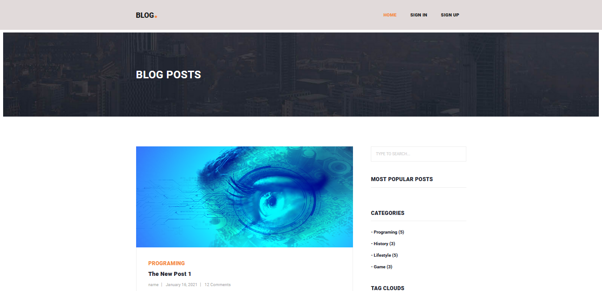

# Django blog



  * This web blog contains all nesessary functionality including:  
     Sign In, Sign Up, authentication, password reset,  show posts list, author profile, author posts,  
     show posts by category, CRUD posts, Update user profile, pagination.
 
## Quick Start

To get this project up and running locally on your computer:
1. Run the following commands (if you're on Windows you may use `py` or `py -3` instead of `python` to start Python):
   ```
   pip3 install -r requirements.txt
   python3 manage.py createsuperuser # Create a superuser
   python3 manage.py runserver
   ```
1. Open a browser to `http://127.0.0.1:8000/admin/` to open the admin site
1. Create a few test user and posts.
1. Or use Sign Up on website to register an dthen create a few test posts.
1. Open tab to `http://127.0.0.1:8000/` to see the main site, with your new posts.


